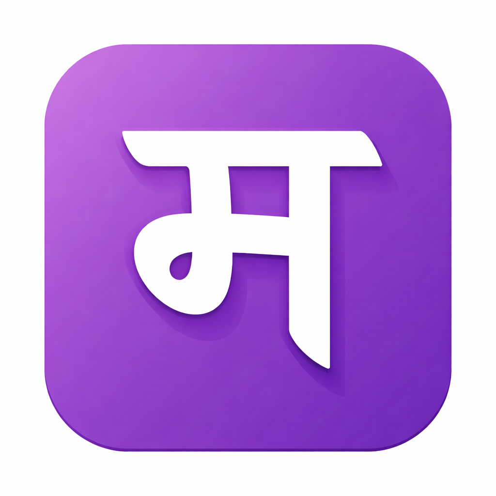
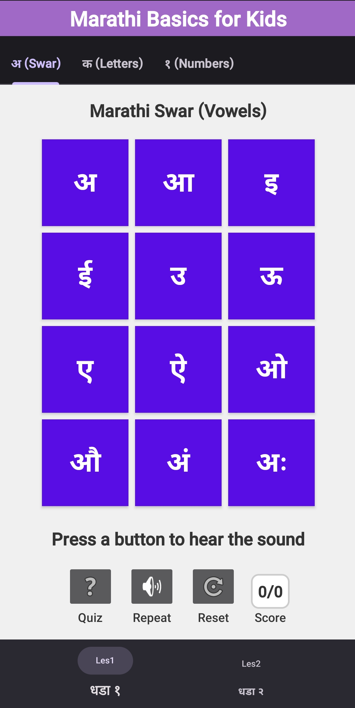
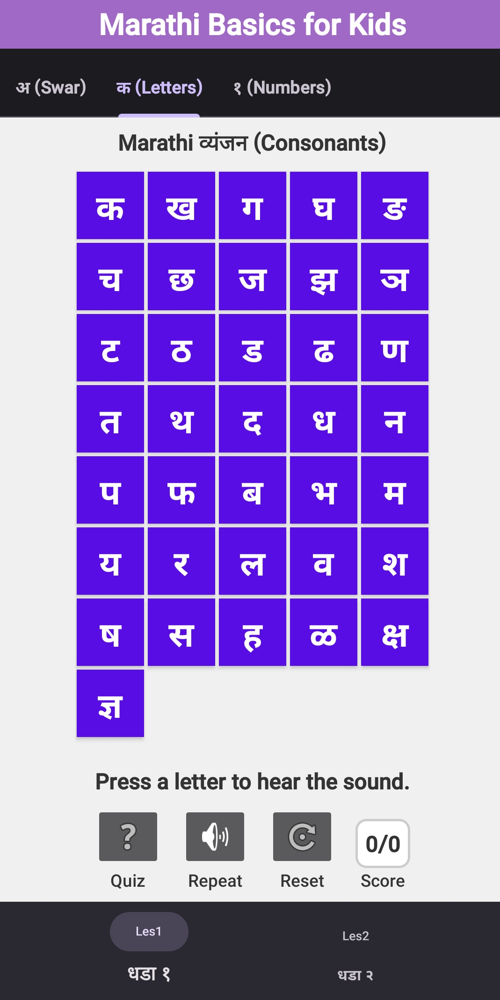
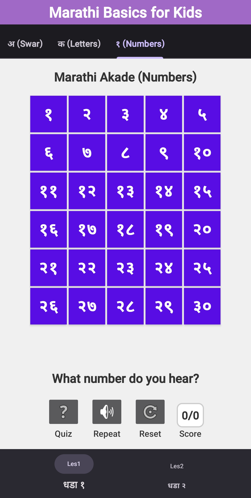

# Marathi Basics for Kids

This is a hobby project. My mother tongue is Marathi. [Marathi](https://en.wikipedia.org/wiki/Marathi_language) is one of the Indian classical language that is spoken by ~83 Million people.
I created this Android application to help teach Marathi to my 7 year old daughter. We live outside India where teaching native Indian language is only possible at home.
Hence the motivation for this application. My aim is that my daughter should be able to both read and write simple marathi words in original Devnagiri script.

## Concept
 
The goal is to learn language as a kid. That is:
- By listening sounds (uses google text to speech)
- Recognizing letters, numbers in devnagiri script
- Trying reading and writing
- Some quiz that tracks points for rewards

## Screenshots

### Alphabet (Vowels) on Phone

### Alphabet (Letters) on Phone

### Alphabet (Numbers) on Phone

## Features

### InProgress
- Sounds for Vowels, Letters, Numbers
- Quiz in which user recongizes for Vowels, Letters, Numbers by sound

### ToDO
- Improve sounds for some letters 
- Add vowel modifier forms in devnagiri
- Add drawing and letter recognition in devnagiri

## Installation

Since this is a hobby draft project, it is not on google playstore yet.
If you want to try the app, please contact me : 
_sinhashubhendu1_ [at) _gmail_ (dot] _com_ 

